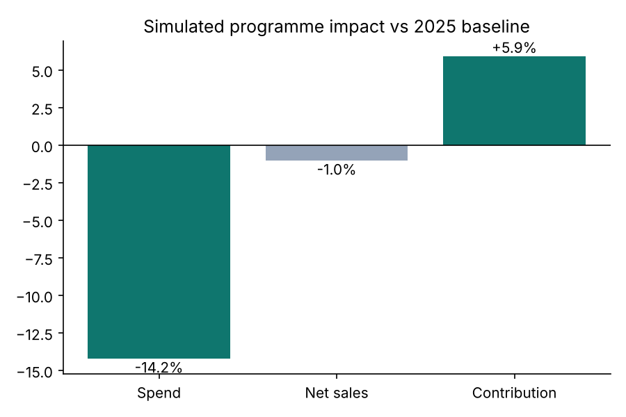
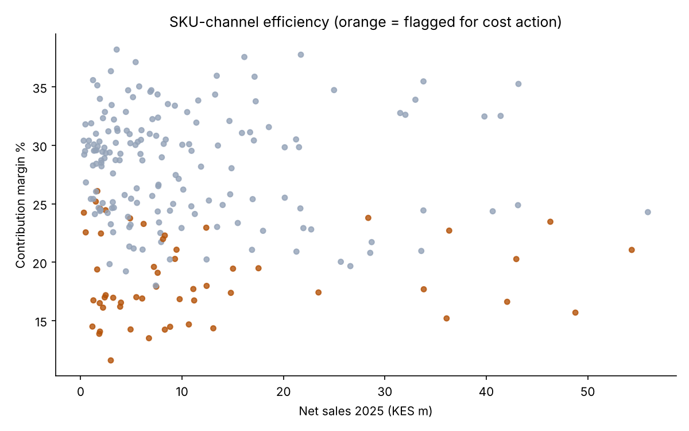
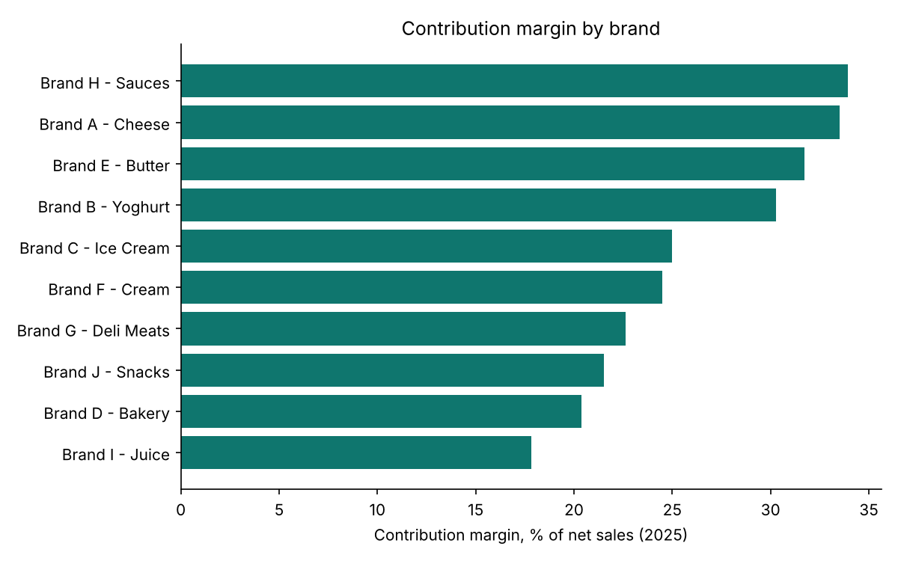

# FMCG P&L Optimisation — brand/SKU cost levers & target cascade

A reproducible version of the method I used to run **"Project 20%"**, a cost-and-revenue programme across 10 brands at an East African FMCG manufacturer. The real programme delivered a **15% cut in expenditure** and a **10% improvement in profit optimisation**.

> **Data note:** everything here runs on **synthetic data** made by `generate_data.py`. No company figures are included.

## What it does

1. **Builds a contribution-margin P&L** by brand, SKU and channel: gross sales → trade discounts → net sales → COGS → logistics, marketing, merchandising → contribution.
2. **Scores efficiency.** Each SKU-channel is ranked on spend per KES of contribution, and the top quartile is flagged for action.
3. **Simulates the programme.** Trade discounts (−35%) and marketing (−40%) are cut on the flagged tail, and an elasticity term models the volume lost when support is removed.
4. **Cascades targets** for the next year from brand → SKU → channel. These give the revenue, spend-budget and contribution targets each manager owns.

## Sample result (synthetic run)

| Metric vs 2025 baseline | Change |
|---|---|
| Total spend | **−14.2%** |
| Net sales | −1.0% |
| Contribution | **+5.9%** |





## Run it

```bash
pip install -r requirements.txt
python generate_data.py      # -> data/pnl_monthly.csv (10 brands, 55 SKUs, 4 channels, 24 months)
python pnl_optimisation.py   # -> outputs/*.png, pnl_by_brand.csv, targets_2026.csv
```

## Files

| File | Purpose |
|---|---|
| `generate_data.py` | Synthetic monthly P&L with seasonality, trend and a built-in inefficient tail |
| `pnl_optimisation.py` | P&L build, efficiency scoring, programme simulation, target cascade, charts |
| `outputs/targets_2026.csv` | Target sheet by brand / SKU / channel, ready for a BI dashboard |

## In production

At work the same logic runs on governed warehouse tables (SQL + dbt/Dataform), and Power BI dashboards track actuals against the cascaded targets each month.

**Stack:** Python · pandas · matplotlib · (prod: SQL, dbt, Dataform, Power BI)
